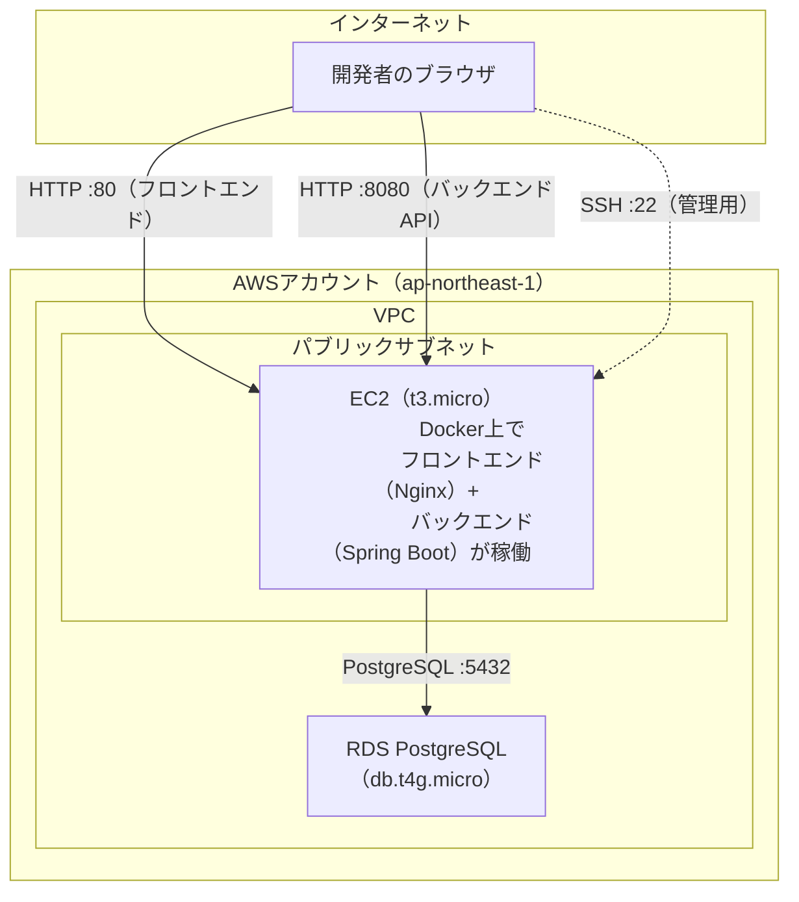

# インフラ構成

本アプリをAWS上にデプロイするためのインフラ構成についてまとめる。マネジメントコンソールは使わず、AWS CLIでの認証設定のもと、Terraformによるコード管理（IaC）でインフラを構築している。

個人利用・スクール課題としての利用を前提とし、認証機能を持たないアプリであることから、**コストを抑えた最小構成**（EC2 1台にフロントエンド・バックエンドを同居させ、DBのみRDSに分離する構成）を採用している。ロードバランサー・NATゲートウェイ・コンテナレジストリ（ECR）などは使用しない。

## 全体構成図



- フロントエンド・バックエンドは同一のEC2インスタンス上でDockerコンテナとして稼働する。
- データベースのみRDS（マネージドPostgreSQL）に分離している。
- SSH・フロントエンド・バックエンドへのアクセスは、いずれも開発者自身のグローバルIPアドレスに限定しており、外部には公開していない。

## 使用しているAWSサービス

| サービス | 役割 |
|---|---|
| VPC / サブネット | EC2・RDSを収容するネットワーク |
| EC2 | フロントエンド（Nginx配信）・バックエンド（Spring Boot）を動かすサーバー |
| RDS（PostgreSQL） | データベース |
| セキュリティグループ | EC2・RDSへの通信をIPアドレス／サービス単位で制御するファイアウォール |
| Elastic IP | EC2に紐づける固定パブリックIP |

## ディレクトリ構成

Terraformのコードは `infra/` にまとめている。

```
trello-clone/
├── infra/                  # Terraformコード一式
│   ├── backend.tf          # tfstateの保管先（S3）の設定（バケット名はbackend.hclで外出し）
│   ├── providers.tf        # 利用するプロバイダ（aws / tls / local）の設定
│   ├── variables.tf        # 環境ごとに変わる値（リージョン・許可IP・DBパスワード）
│   ├── network.tf          # VPC・サブネット・セキュリティグループ
│   ├── ec2.tf              # EC2インスタンス・SSHキーペア
│   ├── database.tf         # RDS（PostgreSQL）
│   ├── outputs.tf          # apply後に表示する値（EC2のIP、RDSのエンドポイントなど）
│   ├── backend.hcl         # tfstate保管先バケット名（Git管理対象外）
│   └── terraform.tfvars    # 実際の値（Git管理対象外）
├── backend/
│   └── Dockerfile          # バックエンドの本番用イメージ定義
├── frontend/
│   ├── Dockerfile          # フロントエンドの本番用イメージ定義（Nginxで配信）
│   └── nginx.conf          # Nginxの配信設定
├── docker-compose.prod.yml # 本番イメージのビルド定義（コンテナ構成の定義用。EC2上での起動には使わない）
└── .env.prod.example       # 本番環境変数のテンプレート（実値はGit管理対象外）
```

## デプロイの流れ

コンテナ構成はDocker Composeで定義し、開発環境ではComposeによる一括起動を行う。AWS EC2環境では、インスタンスのメモリリソースを考慮し、必要なコンテナを `docker run` により個別に起動する。

1. Terraformで `infra/` の内容をAWSに適用し、VPC・EC2・RDSを作成する。
2. ローカル環境でバックエンド・フロントエンドのDockerイメージをビルドする（EC2（t3.micro、メモリ1GB）上でGradle/npmのビルドを行うとメモリ不足でサーバーが応答不能になったため、ローカルでビルドしたイメージを転送する方式を採用している）。
3. ビルドしたイメージをEC2に転送し、`docker run` でコンテナを起動する。
4. EC2のパブリックIPにブラウザでアクセスし、動作確認する。

## 運用上の注意点

- EC2・RDSともにAWS無料利用枠の対象インスタンスタイプを使用しているが、**無料期間には限りがある**（RDSは特に、アカウント作成から一定期間のみ無料）。期間経過後は課金が発生するため、使わない期間は `terraform destroy` でインフラごと削除することを想定している。
- SSH・アプリケーションへのアクセスを許可するIPアドレスは、開発者の環境（グローバルIP）が変わるたびに更新が必要になる。
- DBパスワードなどの秘匿情報はTerraformコードに直書きせず、Git管理対象外のファイル（`terraform.tfvars` / `.env.prod`）で管理している。
