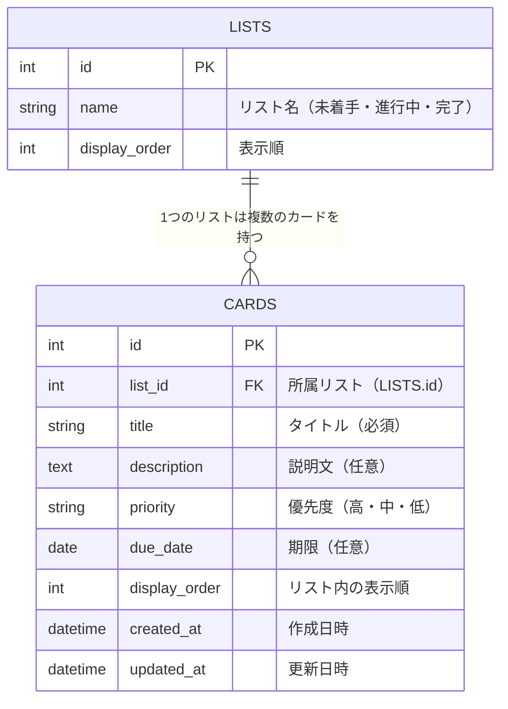

# データベース設計（ER図）

## 1. 前提
- マルチユーザー対応は行わないため、ユーザーテーブルは持たない
- リストは「未着手」「進行中」「完了」の3種類固定のため、リストをマスタテーブルとして持つか、カードテーブルにステータスの値（列挙値）として持たせるかの2案がある。ここでは将来的にリスト自体の管理（名称変更など）が発生しても対応しやすいよう、リストをテーブルとして分離する案を採用する。
- データベース製品は [技術スタック.md](./技術スタック.md) の通りPostgreSQLを使用する。以降のカラム型はPostgreSQLの型名で記載する。

## 2. ER図

## 3. テーブル定義

### LISTS（リストマスタ）

| カラム名 | 型 | 制約 | 説明 |
|---|---|---|---|
| id | SERIAL | PK | リストID |
| name | VARCHAR(50) | NOT NULL | リスト名（例：未着手） |
| display_order | INTEGER | NOT NULL | 画面上の表示順 |

初期データとして「未着手・進行中・完了」の3件を登録しておく。

### CARDS（カード）

| カラム名 | 型 | 制約 | 説明 |
|---|---|---|---|
| id | SERIAL | PK | カードID |
| list_id | INTEGER | FK（LISTS.id）, NOT NULL | 所属リスト |
| title | VARCHAR(50) | NOT NULL | タイトル |
| description | TEXT | NULL可 | 説明文 |
| priority | VARCHAR(10) | NOT NULL | 優先度（'高' / '中' / '低'） |
| due_date | DATE | NULL可 | 期限 |
| display_order | INTEGER | NOT NULL | リスト内での表示順（同一list_id内で一意） |
| created_at | TIMESTAMP | NOT NULL | 作成日時（自動設定） |
| updated_at | TIMESTAMP | NOT NULL | 更新日時（自動更新） |

## 4. 補足
- カードをドラッグ＆ドロップで移動する操作は、CARDSテーブルの`list_id`を更新することで実現する
- カードの並び替え（ドラッグ＆ドロップによる並び替え、優先度順・期限順ボタンによる並び替え）は、CARDSテーブルの`display_order`を更新することで実現する。並び替え発生時は、対象リストに属する全カードの`display_order`を振り直す
- ユーザー管理を行わないため、CARDS・LISTSともに「誰が作成したか」を示すカラムは持たない
